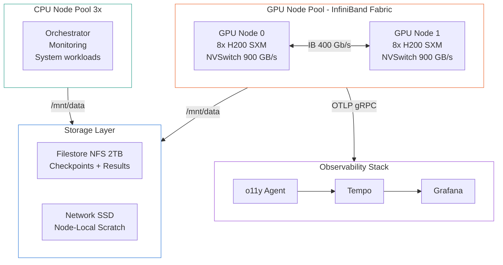
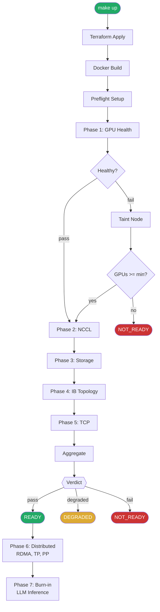
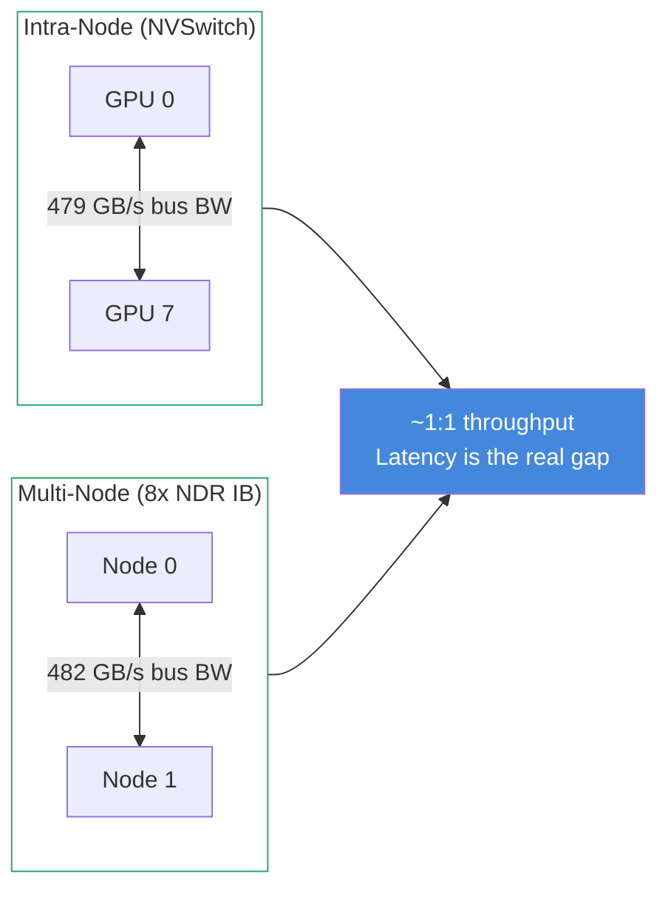
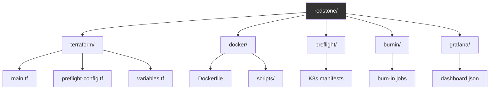

# Architecture Overview

Redstone is a GPU cluster preflight validation suite that runs automated hardware and software checks before training workloads start. It validates the full stack — from individual GPU health through NVLink fabric, InfiniBand topology, shared storage, and TCP control plane — then emits a READY/DEGRADED/NOT_READY verdict.

## Why It Exists

GPU training clusters are complex: 8 GPUs per node connected via NVSwitch, nodes linked over InfiniBand fat trees, shared NFS for checkpoints, and a Kubernetes control plane coordinating everything. Any failure in this stack — a bad GPU, a miscabled IB port, a slow filesystem — silently degrades training throughput or causes hard failures hours into a run.

## Cluster Topology

## Preflight Execution Flow

## NVSwitch vs InfiniBand: What Actually Matters

Each H200 node has 8x 400 Gb/s NDR InfiniBand ports (mlx5_0 through mlx5_7), aggregating to ~400 GB/s per node. Measured NCCL bus bandwidths:

With 8x 400 Gb/s NDR ports per node, aggregate multi-node NCCL bandwidth (482 GB/s) nearly matches intra-node NVSwitch bandwidth (479 GB/s). The raw NVSwitch fabric provides 900 GB/s bidirectional, but NCCL bus bandwidth at the application level lands around 480 GB/s in both cases.

**Where the gap actually matters is latency**, not throughput. NVSwitch all-reduce completes in a single hop across a full mesh. IB all-reduce traverses a fat-tree topology with 1-3 us per hop depending on leaf/spine placement. For latency-sensitive operations like TP all-reduce (called every transformer layer), this per-operation overhead accumulates. For bulk transfers like PP activation sends, the aggregate bandwidth is what matters, and IB keeps up.

The [NCCL test](../components/nccl-test.md) isolates NVSwitch with `NCCL_IB_DISABLE=1`. The [IB topology](../components/ib-topology.md) maps leaf/spine placement and per-port latency. The [distributed validation](../components/distributed-validate.md) measures the TP=8 vs TP=16 scaling ratio, quantifying the latency gap's practical cost.

## System Components

### Test Scripts (9 scripts)

All scripts live in `docker/scripts/` and share:
- Config from a K8s ConfigMap mounted at `/etc/redstone/config.json`
- OTel tracing via [tracing.py](../components/tracing.md)
- JSON results written to shared filesystem

| Script | Purpose | Runs As | Wiki Page |
|--------|---------|---------|-----------|
| `orchestrator.py` | Sequences phases, aggregates verdict | Job (CPU node) | [Orchestrator](../components/orchestrator.md) |
| `gpu_health.py` | Per-GPU driver/CUDA/matmul checks | DaemonSet (GPU nodes) | [GPU Health](../components/gpu-health.md) |
| `nccl_test.py` | NCCL collective bandwidth (NVSwitch) | Job (per GPU node) | [NCCL Test](../components/nccl-test.md) |
| `ib_topology.py` | IB fat tree latency mapping | Job (server + client) | [IB Topology](../components/ib-topology.md) |
| `storage_test.py` | fio shared FS + local SSD | Job (per GPU node) | [Storage Test](../components/storage-test.md) |
| `tcp_test.py` | iperf3 control plane bandwidth | Job (per pair) | [TCP Test](../components/tcp-test.md) |
| `distributed_validate.py` | torchrun RDMA/TP/PP benchmarks | Job (indexed) | [Distributed Validate](../components/distributed-validate.md) |
| `training_burnin.py` | LLM inference burn-in | Job (GPU node) | [Training Burn-in](../components/training-burnin.md) |
| `tracing.py` | Shared OTel setup | Imported by all | [Tracing](../components/tracing.md) |

### Infrastructure

| Layer      | Purpose                                             | Wiki Page                                                  |
| ---------- | --------------------------------------------------- | ---------------------------------------------------------- |
| Terraform  | Cluster provisioning (Nebius k8s-training module)   | [Terraform](../infrastructure/terraform.md)                |
| Docker     | Container images with CUDA, NCCL tests, fio, iperf3 | [Docker](../infrastructure/docker.md)                      |
| Kubernetes | DaemonSets, Jobs, CronJob, RBAC                     | [K8s Manifests](../infrastructure/kubernetes-manifests.md) |
| Makefile   | Pipeline orchestration: `make up` through verdict   | [Makefile](../infrastructure/makefile.md)                  |

### Design Patterns

| Pattern | Why It Exists | Wiki Page |
|---------|---------------|-----------|
| ConfigMap thresholds | Tune without rebuilding images | [ConfigMap Thresholds](../patterns/configmap-thresholds.md) |
| Node tainting | Auto-exclude bad GPUs from training | [Node Tainting](../patterns/node-tainting.md) |
| Shared FS coordination | Result passing, master IP discovery | [Shared FS Coordination](../patterns/shared-fs-coordination.md) |
| Poll-based orchestration | Handle dynamic node availability | [Poll-Based Orchestration](../patterns/poll-based-orchestration.md) |
| Multi-provider inference | vLLM/SGLang/Ollama abstraction | [Multi-Provider Inference](../patterns/multi-provider-inference.md) |

## Codebase Structure

## Redstone Source Docs

The redstone repo includes its own documentation alongside the code:

- [Architecture](../redstone/docs/architecture.md) — compact architecture reference
- [Diagrams](../redstone/docs/diagrams.md) — Mermaid diagrams: cluster topology, trace flow, execution flow, Gantt timeline, observability stack, NVSwitch vs IB gap
- [Thresholds](../redstone/docs/thresholds.md) — threshold justification with hardware rationale
- [Known Limitations](../redstone/docs/known-limitations.md) — design trade-offs, planned improvements

## Cross-References

- [Execution Flow](execution-flow.md) — step-by-step `make up` to verdict
- [Decision Logic](decision-logic.md) — how READY/DEGRADED/NOT_READY is computed
- [Observability](observability.md) — OTel → Tempo → Grafana pipeline
- [Code Index](../reference/code-index.md) — master symbol lookup table
